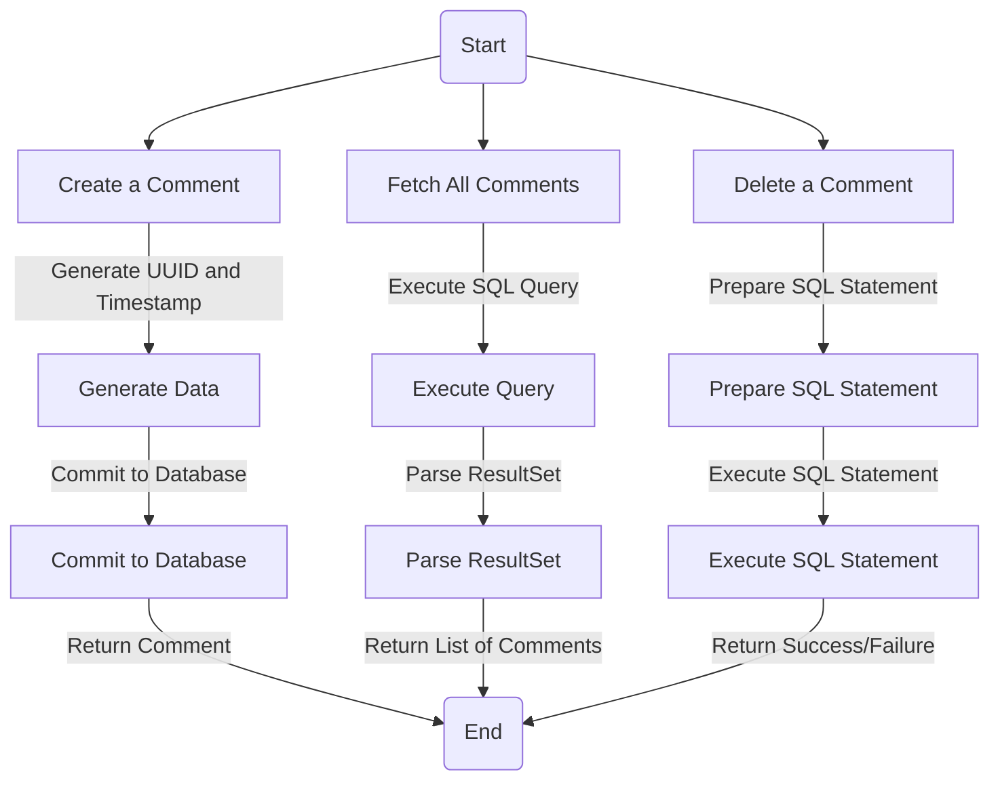
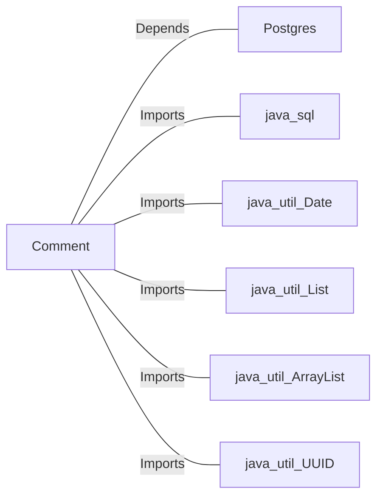

# Comment.java: Comment Management System

## Overview
The `Comment` class is responsible for managing comments in a system. It provides functionalities to create, fetch, and delete comments, as well as commit them to a database. The class interacts with a PostgreSQL database to store and retrieve comment data.

## Process Flow

## Insights
- The class uses a PostgreSQL database to store and manage comments.
- Comments are uniquely identified using UUIDs.
- The `create` method generates a new comment and commits it to the database.
- The `fetchAll` method retrieves all comments from the database.
- The `delete` method removes a comment from the database based on its ID.
- The `commit` method inserts a new comment into the database.
- Exception handling is implemented but lacks proper logging and detailed error messages.

## Dependencies

- `Postgres`: Handles database connections and operations.
- `java.sql`: Provides classes for database interaction.
- `java.util.Date`: Used for timestamp generation.
- `java.util.List`: Used to store and manage lists of comments.
- `java.util.ArrayList`: Implementation of the `List` interface.
- `java.util.UUID`: Used to generate unique identifiers for comments.

## Data Manipulation (SQL)
### Table Structure: `comments`
| Attribute   | Data Type   | Description                          |
|-------------|-------------|--------------------------------------|
| `id`        | `VARCHAR`   | Unique identifier for the comment.  |
| `username`  | `VARCHAR`   | Username of the comment author.     |
| `body`      | `TEXT`      | Content of the comment.             |
| `createdon` | `TIMESTAMP` | Timestamp when the comment was created. |

### SQL Operations
- **INSERT**: Adds a new comment to the `comments` table.
- **SELECT**: Retrieves all comments from the `comments` table.
- **DELETE**: Removes a comment from the `comments` table based on its ID.

## Vulnerabilities
1. **SQL Injection**:
   - The `fetchAll` method constructs SQL queries using string concatenation, making it vulnerable to SQL injection attacks.
   - The `delete` method uses a prepared statement but does not handle exceptions properly, which could lead to unintended behavior.

2. **Error Handling**:
   - Exception handling is inconsistent and lacks proper logging. Errors are printed to `System.err` without detailed context.

3. **Resource Management**:
   - Database connections are not always closed properly, which could lead to resource leaks.

4. **Commit Method**:
   - The `commit` method does not validate input data, which could lead to invalid or malicious data being inserted into the database.

5. **Concurrency Issues**:
   - The class does not handle concurrent access to the database, which could lead to race conditions or data corruption.

6. **Hardcoded SQL Statements**:
   - SQL statements are hardcoded, making them difficult to maintain and prone to errors during updates.
