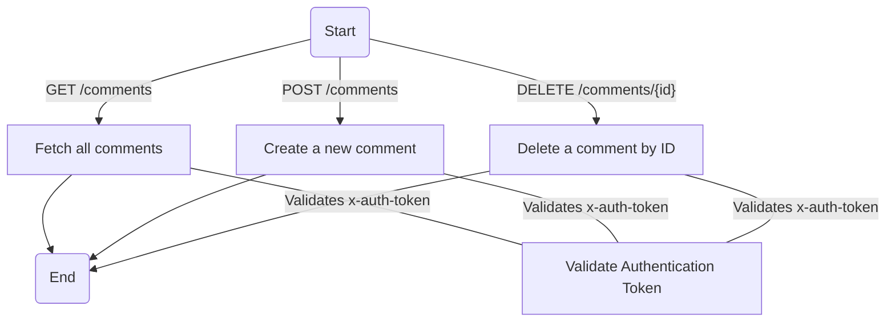
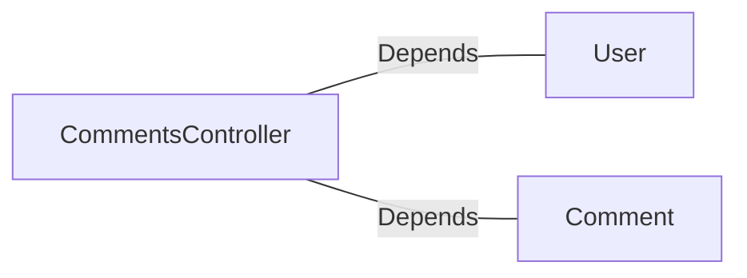

# CommentsController.java: REST API for Managing Comments

## Overview
The `CommentsController` class is a REST API controller for managing comments. It provides endpoints to retrieve, create, and delete comments. The controller includes authentication mechanisms and handles exceptions for bad requests and server errors.

## Process Flow

## Insights
- The controller uses Spring annotations to define REST endpoints and enable cross-origin requests.
- Authentication is performed using a custom method `User.assertAuth(secret, token)` with a token passed in the `x-auth-token` header.
- The `CommentRequest` class is used as a data structure for creating comments, containing `username` and `body` attributes.
- Exception handling is implemented with custom exceptions (`BadRequest` and `ServerError`) annotated with HTTP status codes.
- The `Comment` class is assumed to provide static methods for fetching, creating, and deleting comments.

## Dependencies

- `User`: Used for authentication via the `assertAuth(secret, token)` method.
- `Comment`: Provides static methods `fetchAll()`, `create(username, body)`, and `delete(id)` for comment management.

## Data Manipulation (SQL)
- No direct SQL manipulation is detected in the code. The `Comment` class likely interacts with a database, but the implementation is not provided.

## Vulnerabilities
1. **Hardcoded Secret**:
   - The `secret` variable is hardcoded in the application, which is a security risk. Secrets should be stored securely, such as in environment variables or a secrets management system.

2. **Authentication Token Validation**:
   - The authentication mechanism relies on a custom method `User.assertAuth(secret, token)`. If this method is not implemented securely, it could lead to vulnerabilities such as token forgery or replay attacks.

3. **Cross-Origin Resource Sharing (CORS)**:
   - The `@CrossOrigin` annotation allows requests from all origins. This could expose the API to unauthorized access if not properly restricted.

4. **Error Handling**:
   - The custom exceptions (`BadRequest` and `ServerError`) do not provide detailed error messages or logging, which could make debugging and monitoring difficult.

5. **Input Validation**:
   - The `CommentRequest` class does not validate the `username` or `body` fields. This could lead to issues such as SQL injection or XSS if the `Comment` class interacts with a database or renders the data in a web application.

6. **Path Variable Validation**:
   - The `id` parameter in the `DELETE` endpoint is not validated, which could lead to unintended behavior or security issues.

## Recommendations
- Store the `secret` securely using environment variables or a secrets management system.
- Implement robust token validation and consider using industry-standard authentication mechanisms like OAuth2 or JWT.
- Restrict CORS to trusted origins.
- Add input validation for `CommentRequest` fields and sanitize data before processing.
- Validate the `id` parameter in the `DELETE` endpoint to ensure it conforms to expected formats.
- Enhance error handling with detailed messages and logging for better monitoring and debugging.
