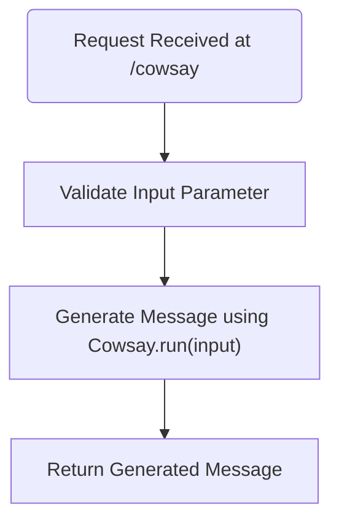
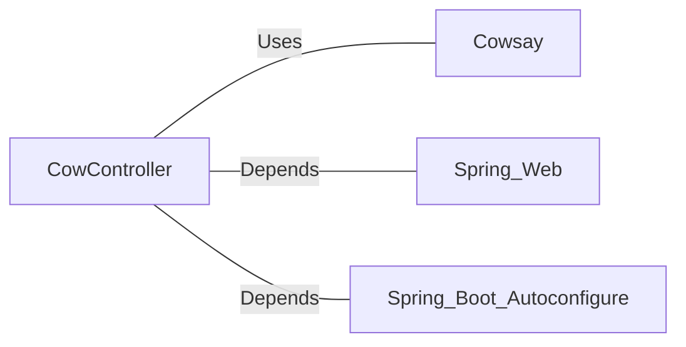

# CowController.java: Cow Controller for Generating Cow Say Messages

## Overview
The `CowController` class is a Spring Boot REST controller designed to generate "cowsay" messages based on user input. It provides an endpoint that accepts a string parameter and returns a formatted message using the `Cowsay.run()` method.

## Process Flow

## Insights
- The class is annotated with `@RestController` and `@EnableAutoConfiguration`, making it a Spring Boot REST controller with automatic configuration.
- The `cowsay` endpoint accepts a query parameter `input` with a default value of "I love Linux!".
- The `Cowsay.run()` method is used to generate the cow message, but its implementation is not provided in the code snippet.
- The code lacks input validation or sanitization, which could lead to potential vulnerabilities.

## Vulnerabilities
1. **Input Injection**:
   - The `input` parameter is directly passed to `Cowsay.run()` without validation or sanitization. If `Cowsay.run()` executes system commands or interprets special characters, this could lead to command injection or other security issues.

2. **Missing Error Handling**:
   - The code does not handle exceptions that might occur during the execution of `Cowsay.run()`. This could result in unhandled errors and potential application crashes.

3. **Hardcoded Default Value**:
   - The default value "I love Linux!" is hardcoded, which might not be suitable for all use cases. Consider externalizing this value for better configurability.

## Dependencies

- `Cowsay`: Used to generate the cow message. The nature of its implementation is not provided in the code snippet.
- `Spring_Web`: Provides the `@RestController` and `@RequestMapping` annotations for building RESTful web services.
- `Spring_Boot_Autoconfigure`: Enables automatic configuration for the Spring Boot application.

## Recommendations
- Implement input validation and sanitization to prevent potential injection attacks.
- Add error handling to manage exceptions gracefully.
- Externalize the default value for the `input` parameter to a configuration file or environment variable for better flexibility.
