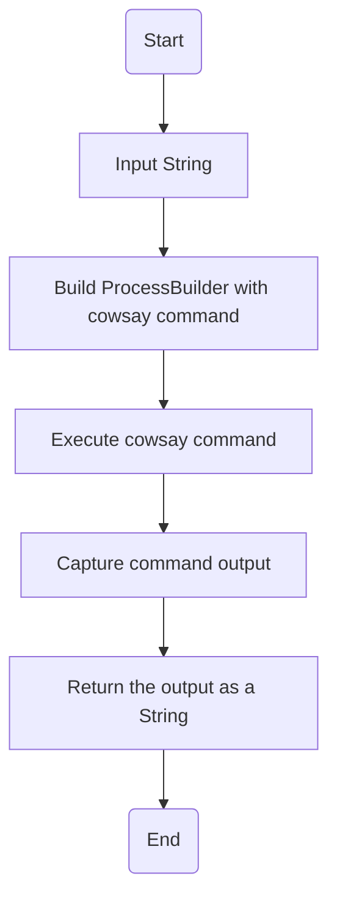
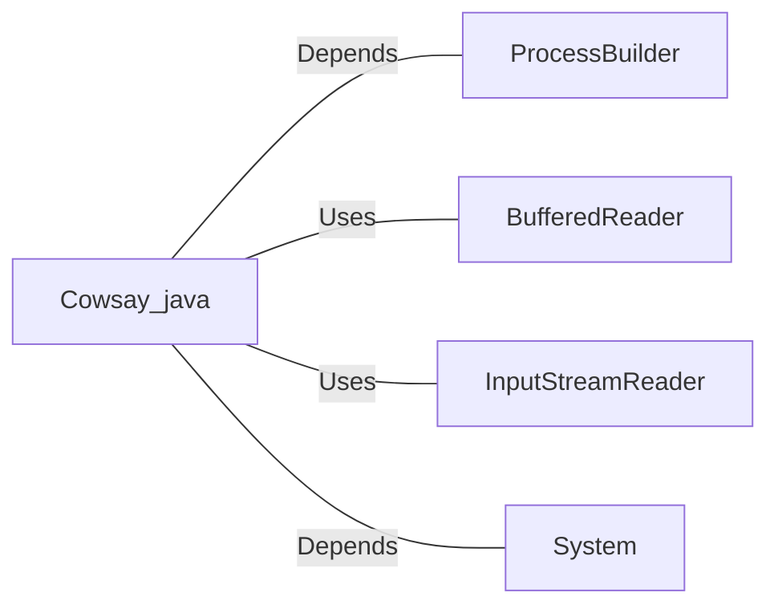

# Cowsay.java: Command Execution Wrapper for Cowsay

## Overview
This program is designed to execute the `cowsay` command-line tool, which generates ASCII art of a cow saying a given input string. It uses Java's `ProcessBuilder` to invoke the command and capture its output. The program is part of the `com.scalesec.vulnado` package.

## Process Flow

## Insights
- The program dynamically constructs and executes a shell command using `ProcessBuilder`.
- It captures the output of the `cowsay` command and returns it as a string.
- The use of `ProcessBuilder` allows for flexible command execution but introduces potential security risks if the input is not sanitized.

## Vulnerabilities
1. **Command Injection**:
   - The input string is directly concatenated into the command without any sanitization or validation. This makes the program vulnerable to command injection attacks, where malicious input could execute arbitrary commands on the host system.
   - Example: If the input is `"; rm -rf /"`, it could lead to catastrophic consequences.

2. **Error Handling**:
   - The program uses a generic `catch` block that prints the stack trace but does not handle errors gracefully. This could lead to unhandled exceptions or incomplete output in case of errors.

3. **Hardcoded Command Path**:
   - The path to the `cowsay` executable (`/usr/games/cowsay`) is hardcoded, which may cause issues if the executable is not located at the specified path on the host system.

4. **Resource Management**:
   - The `BufferedReader` is not closed explicitly, which could lead to resource leaks.

## Dependencies

- `ProcessBuilder`: Used to construct and execute the shell command.
- `BufferedReader`: Used to read the output of the executed command.
- `InputStreamReader`: Wraps the input stream of the process for reading.
- `System`: Used for printing debug information.

## Recommendations
- **Input Sanitization**: Validate and sanitize the input string to prevent command injection.
- **Error Handling**: Implement more robust error handling to manage exceptions gracefully.
- **Dynamic Command Path**: Use environment variables or configuration files to determine the path to the `cowsay` executable.
- **Resource Management**: Ensure proper closure of resources like `BufferedReader` using try-with-resources or explicit `close()` calls.
