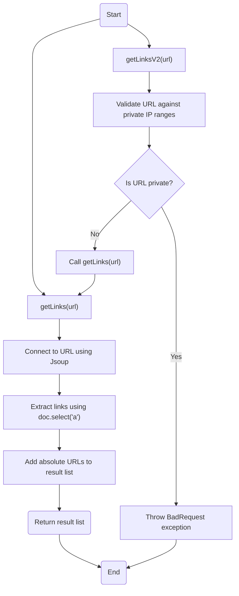
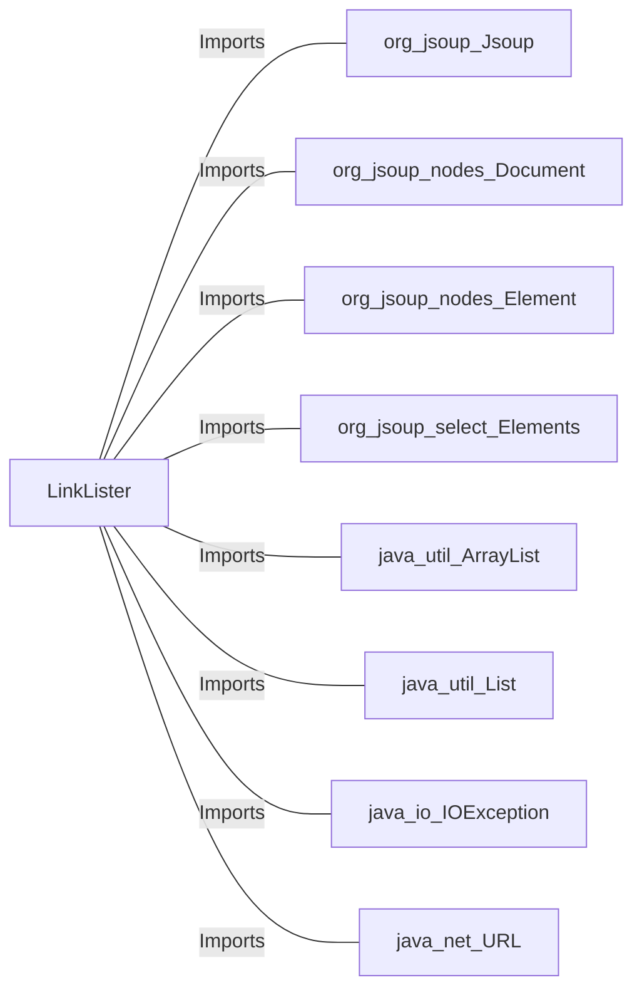

# LinkLister.java: URL Link Extraction and Validation

## Overview
The `LinkLister` class is responsible for extracting hyperlinks from a given URL and validating the URL to ensure it does not belong to private IP ranges. It provides two main methods:
1. `getLinks`: Extracts all hyperlinks from a given URL.
2. `getLinksV2`: Validates the URL against private IP ranges before extracting hyperlinks.

## Process Flow

## Insights
- The `getLinks` method uses the Jsoup library to connect to a URL and extract all hyperlinks (`<a>` tags) from the HTML document.
- The `getLinksV2` method adds an additional layer of validation to ensure the URL does not belong to private IP ranges (e.g., `172.*`, `192.168.*`, `10.*`).
- The `getLinksV2` method throws a `BadRequest` exception if the URL belongs to a private IP range.
- The `getLinksV2` method relies on the `getLinks` method for hyperlink extraction after validation.

## Dependencies

- `org.jsoup.Jsoup`: Used for connecting to the URL and parsing the HTML document.
- `org.jsoup.nodes.Document`: Represents the HTML document.
- `org.jsoup.nodes.Element`: Represents an HTML element.
- `org.jsoup.select.Elements`: Represents a collection of HTML elements.
- `java.util.ArrayList`: Used to store the list of extracted links.
- `java.util.List`: Interface for the list of links.
- `java.io.IOException`: Handles exceptions related to input/output operations.
- `java.net.URL`: Used for URL validation and extracting the host.

## Vulnerabilities
- **Private IP Validation**: The validation logic in `getLinksV2` only checks for specific private IP ranges (`172.*`, `192.168.*`, `10.*`). It does not account for other private or reserved IP ranges (e.g., `127.0.0.1`, `169.254.*`, or IPv6 private addresses).
- **Unvalidated URL Input**: The `getLinks` method does not validate the URL before connecting, which could lead to potential security risks such as SSRF (Server-Side Request Forgery).
- **Exception Handling**: The `getLinksV2` method catches all exceptions and wraps them in a `BadRequest` exception. This could mask the root cause of the error and make debugging difficult.
- **No Timeout Configuration**: The Jsoup connection does not specify a timeout, which could lead to indefinite hanging if the URL is unresponsive.
- **Potential Information Disclosure**: The `System.out.println(host)` statement in `getLinksV2` could expose sensitive information about the host in logs.

## Recommendations
- Enhance private IP validation to include all reserved IP ranges and IPv6 addresses.
- Validate the URL format and domain before connecting in both methods.
- Implement specific exception handling to avoid masking errors.
- Configure a timeout for Jsoup connections to prevent indefinite hanging.
- Remove or secure logging statements to avoid information disclosure.
