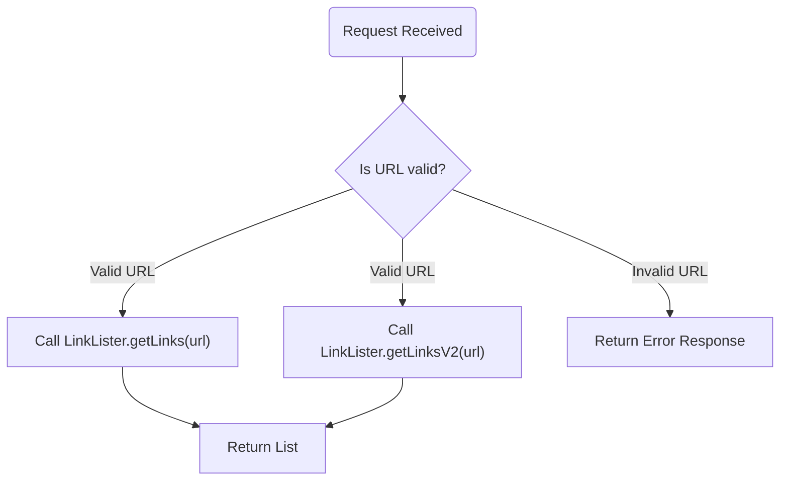
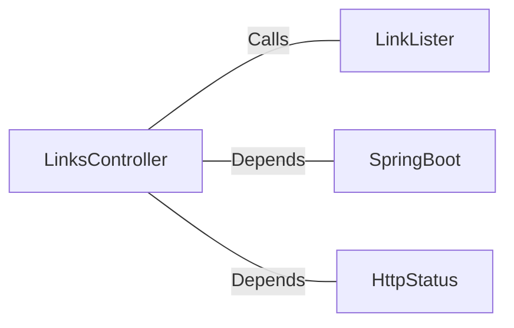

# LinksController.java: REST API for Link Listing

## Overview
The `LinksController` class is a REST API controller designed to handle HTTP requests for listing links. It provides two endpoints (`/links` and `/linksv2`) that accept a URL as a parameter and return a list of links extracted from the provided URL. The class uses Spring Boot annotations for configuration and routing.

## Process Flow

## Insights
- The class defines two endpoints:
  - `/links`: Calls `LinkLister.getLinks(url)` to retrieve links.
  - `/linksv2`: Calls `LinkLister.getLinksV2(url)` to retrieve links.
- Both endpoints expect a `url` parameter and return a `List<String>` in JSON format.
- The `/linksv2` endpoint throws a `BadRequest` exception for invalid URLs, while `/links` throws an `IOException`.
- The class uses Spring Boot annotations:
  - `@RestController`: Marks the class as a REST controller.
  - `@EnableAutoConfiguration`: Enables Spring Boot's auto-configuration.
  - `@RequestMapping`: Maps HTTP requests to handler methods.

## Dependencies

- `LinkLister`: Provides methods `getLinks(url)` and `getLinksV2(url)` to extract links from the given URL.
- `SpringBoot`: Framework used for building the application.
- `HttpStatus`: Used for HTTP response status codes.

## Vulnerabilities
- **Improper Input Validation**: The `url` parameter is not validated for malicious inputs, which could lead to security vulnerabilities such as SSRF (Server-Side Request Forgery).
- **Exception Handling**: The `/links` endpoint throws a generic `IOException`, which may expose internal details of the application. Proper error handling should be implemented.
- **Error Response Consistency**: The `/linksv2` endpoint throws a `BadRequest` exception, while `/links` does not. This inconsistency may confuse API consumers.
- **Serialization Risks**: The returned `List<String>` is directly serialized into JSON without sanitization, which could lead to injection attacks if the links contain malicious content.

## Recommendations
- Validate the `url` parameter to ensure it is a well-formed and safe URL.
- Implement consistent error handling and response formatting for both endpoints.
- Sanitize the links before returning them to prevent injection attacks.
- Consider logging errors securely without exposing sensitive information.
