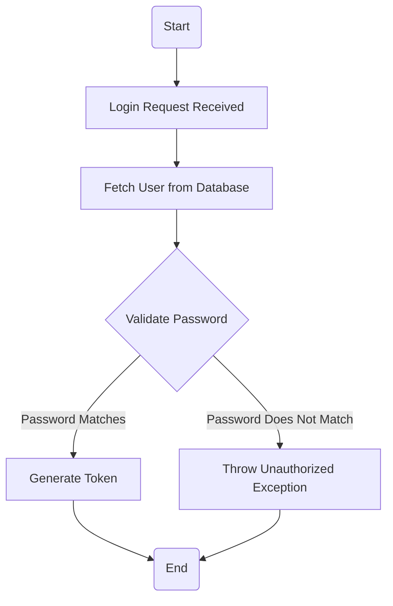
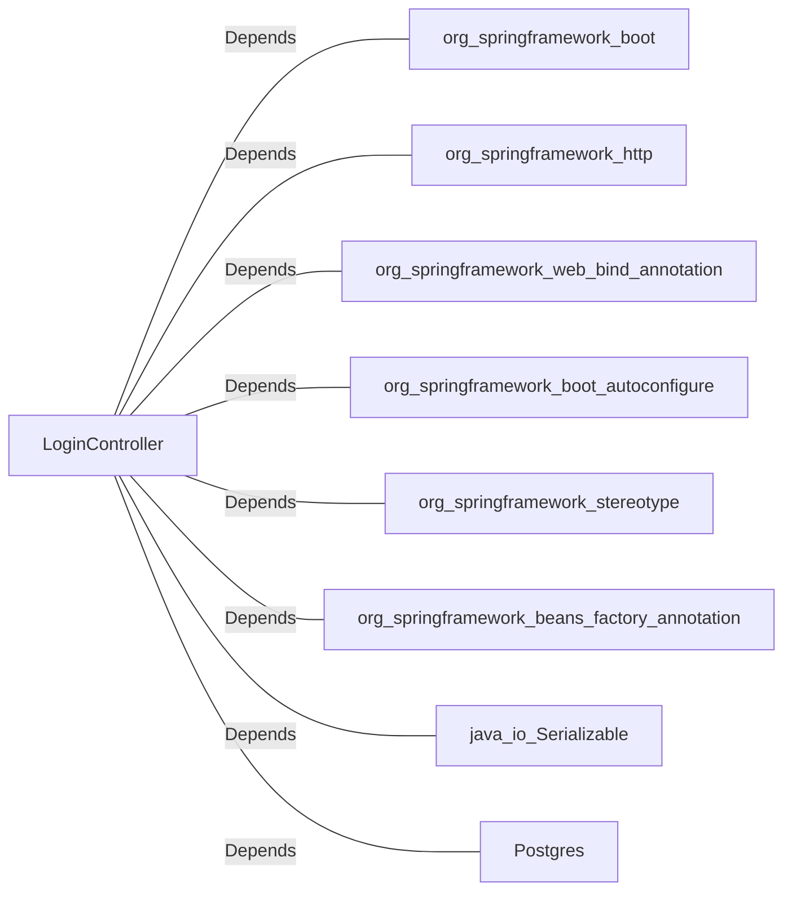

# LoginController.java: Login Management Controller

## Overview
The `LoginController` class is a REST controller responsible for handling login requests in a web application. It validates user credentials against stored hashed passwords and generates a token for successful authentication. The controller uses Spring Boot annotations for configuration and routing.

## Process Flow

## Insights
- The controller uses `@RestController` and `@EnableAutoConfiguration` annotations to define a RESTful service and enable Spring Boot auto-configuration.
- The `@CrossOrigin` annotation allows cross-origin requests, which is useful for enabling communication between different domains.
- The `@RequestMapping` annotation maps the `/login` endpoint to handle POST requests with JSON input and output.
- Password validation is performed using MD5 hashing, which is considered insecure and should be replaced with a stronger hashing algorithm like bcrypt or Argon2.
- The `LoginRequest` and `LoginResponse` classes are simple data structures for handling input and output of the login process.
- The `Unauthorized` exception is thrown when authentication fails, returning an HTTP 401 status code.

## Vulnerabilities
1. **Insecure Password Hashing**:
   - The use of MD5 for password hashing is insecure and vulnerable to collision attacks. It is recommended to use a stronger hashing algorithm like bcrypt or Argon2.

2. **Hardcoded Secret**:
   - The `secret` value is hardcoded in the application, which can lead to security risks if exposed. It should be stored securely, such as in environment variables or a secrets management tool.

3. **Potential SQL Injection**:
   - The `User.fetch(input.username)` method is not shown in the code, but if it directly uses the `username` input in a SQL query without sanitization, it could be vulnerable to SQL injection.

4. **Cross-Origin Resource Sharing (CORS)**:
   - The `@CrossOrigin` annotation allows all origins, which might expose the application to security risks. It is recommended to restrict origins to trusted domains.

5. **Lack of Rate Limiting**:
   - The login endpoint does not implement rate limiting, making it susceptible to brute force attacks.

6. **Exception Handling**:
   - The `Unauthorized` exception does not provide detailed logging or tracking, which could make debugging and monitoring more difficult.

## Dependencies

- `org.springframework.boot`: Provides Spring Boot framework functionalities.
- `org.springframework.http`: Used for HTTP status codes and responses.
- `org.springframework.web.bind.annotation`: Provides annotations for mapping web requests.
- `org.springframework.boot.autoconfigure`: Enables auto-configuration for Spring Boot applications.
- `org.springframework.stereotype`: Used for marking classes as Spring components.
- `org.springframework.beans.factory.annotation`: Provides dependency injection annotations.
- `java.io.Serializable`: Used for serializing `LoginRequest` and `LoginResponse` objects.
- `Postgres`: Likely used for database operations, though the exact implementation is not provided.

## Data Manipulation (SQL)
- **User.fetch(input.username)**: Likely performs a SELECT operation to retrieve user details based on the provided username. Ensure proper sanitization to prevent SQL injection.

## Recommendations
- Replace MD5 hashing with a secure algorithm like bcrypt or Argon2.
- Store the `secret` securely using environment variables or a secrets management tool.
- Implement input sanitization and parameterized queries to prevent SQL injection.
- Restrict CORS origins to trusted domains.
- Add rate limiting to the login endpoint to mitigate brute force attacks.
- Enhance exception handling with detailed logging and monitoring.
