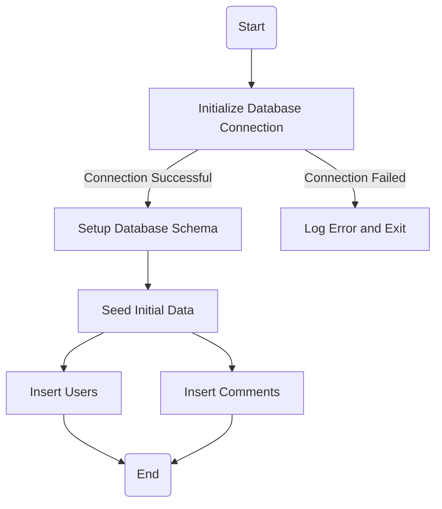
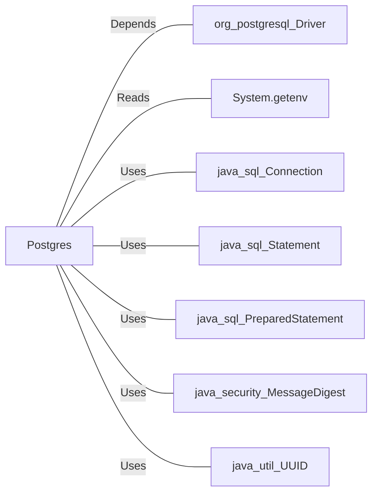

# Postgres.java: Database Setup and Utility Class for User and Comment Management

## Overview

This Java class, `Postgres`, is responsible for managing a PostgreSQL database. It provides functionality to:
- Establish a connection to the database using environment variables.
- Set up the database schema and seed it with initial data.
- Insert user and comment records into the database.
- Generate MD5 hashes for password storage.

The class includes methods for database setup, user and comment insertion, and password hashing.

## Process Flow

## Insights

- **Database Connection**: The connection is established using environment variables (`PGHOST`, `PGDATABASE`, `PGUSER`, `PGPASSWORD`).
- **Schema Setup**: Two tables are created:
  - `users`: Stores user information, including `userid`, `username`, `password`, `createdon`, and `lastlogin`.
  - `comments`: Stores comments with `id`, `username`, `body`, and `createdon`.
- **Data Seeding**: Initial users and comments are inserted into the database.
- **Password Hashing**: Passwords are hashed using the MD5 algorithm before being stored in the database.
- **Error Handling**: Errors during database connection or operations are logged, and the program exits with a non-zero status.

## Dependencies

- `org_postgresql_Driver`: PostgreSQL JDBC driver for database connectivity.
- `System.getenv`: Reads environment variables for database configuration.
- `java_sql_Connection`: Manages the database connection.
- `java_sql_Statement`: Executes SQL statements.
- `java_sql_PreparedStatement`: Executes parameterized SQL queries.
- `java_security_MessageDigest`: Generates MD5 hashes for passwords.
- `java_util_UUID`: Generates unique identifiers for users and comments.

## Data Manipulation (SQL)

### Table Structures

#### `users` Table
| Attribute   | Data Type   | Description                          |
|-------------|-------------|--------------------------------------|
| `userid`    | VARCHAR(36) | Primary key, unique user identifier. |
| `username`  | VARCHAR(50) | Unique username, not null.           |
| `password`  | VARCHAR(50) | Hashed password, not null.           |
| `createdon` | TIMESTAMP   | Timestamp of user creation.          |
| `lastlogin` | TIMESTAMP   | Timestamp of last login.             |

#### `comments` Table
| Attribute   | Data Type   | Description                          |
|-------------|-------------|--------------------------------------|
| `id`        | VARCHAR(36) | Primary key, unique comment ID.      |
| `username`  | VARCHAR(36) | Username of the commenter.           |
| `body`      | VARCHAR(500)| Comment text.                        |
| `createdon` | TIMESTAMP   | Timestamp of comment creation.       |

### SQL Operations

- **Schema Creation**:
  - `CREATE TABLE IF NOT EXISTS users (...)`
  - `CREATE TABLE IF NOT EXISTS comments (...)`
- **Data Cleanup**:
  - `DELETE FROM users`
  - `DELETE FROM comments`
- **Data Insertion**:
  - `INSERT INTO users (userid, username, password, createdon) VALUES (?, ?, ?, current_timestamp)`
  - `INSERT INTO comments (id, username, body, createdon) VALUES (?, ?, ?, current_timestamp)`

## Vulnerabilities

1. **MD5 Hashing**:
   - MD5 is considered cryptographically insecure and should not be used for password hashing. A stronger algorithm like bcrypt, Argon2, or PBKDF2 should be used.

2. **Hardcoded Seed Data**:
   - The seed data includes plaintext passwords, which is a security risk. These should be hashed before being stored.

3. **Error Logging**:
   - Errors are printed to the console, which may expose sensitive information. A proper logging framework should be used with controlled verbosity.

4. **SQL Injection Risk**:
   - While `PreparedStatement` is used for user and comment insertion, other parts of the code (e.g., schema setup) use `Statement`, which is vulnerable to SQL injection. Always use `PreparedStatement` for executing SQL queries.

5. **Environment Variable Handling**:
   - The program assumes that all required environment variables are set. Missing or improperly configured variables could lead to runtime errors. Proper validation should be added.
