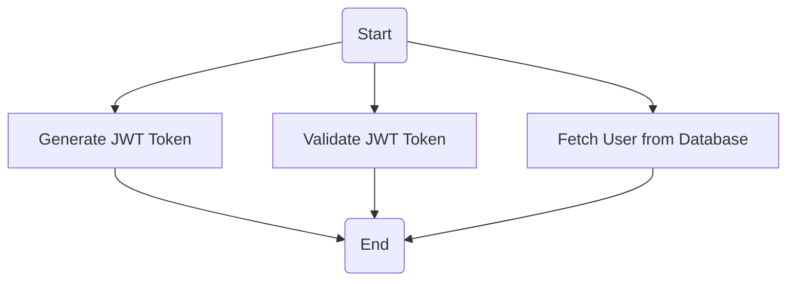
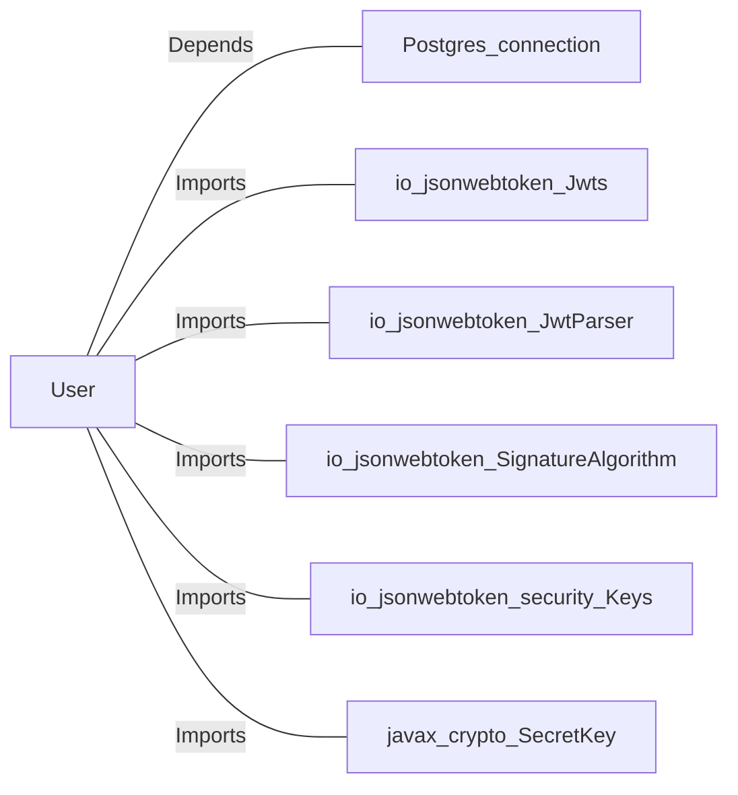

# User.java: User Management and Authentication

## Overview
The `User` class is responsible for managing user-related operations, including user authentication, token generation, and fetching user details from a database. It provides methods for creating JSON Web Tokens (JWTs), validating tokens, and retrieving user information from a PostgreSQL database.

## Process Flow

## Insights
- The class uses JWT for authentication and token management.
- The `fetch` method retrieves user details from a PostgreSQL database using the username.
- The `assertAuth` method validates a JWT token using a secret key.
- The `token` method generates a JWT token for a user using their username.
- The database connection is not properly closed in case of an exception, which may lead to resource leaks.
- The code does not sanitize the `username` input in the `fetch` method, making it vulnerable to SQL injection.

## Vulnerabilities
1. **SQL Injection**:
   - The `fetch` method constructs a SQL query using string concatenation with unsanitized user input (`username`). This makes the code vulnerable to SQL injection attacks.
   - Example: A malicious user could pass a crafted `username` value like `"' OR '1'='1"` to bypass authentication.

2. **Improper Exception Handling**:
   - The `assertAuth` method catches exceptions but rethrows them without proper handling. This could expose sensitive information in the exception message.

3. **Resource Leak**:
   - The database connection (`cxn`) is not closed in the `catch` block, which may lead to resource leaks if an exception occurs.

4. **Weak Error Messages**:
   - The error messages printed in the `catch` blocks may expose internal details of the application, which could be exploited by attackers.

## Dependencies

- `Postgres.connection`: Used to establish a connection to the PostgreSQL database.
- `io.jsonwebtoken.Jwts`: Used for creating and parsing JWT tokens.
- `io.jsonwebtoken.JwtParser`: Used for parsing JWT tokens.
- `io.jsonwebtoken.SignatureAlgorithm`: Used for specifying the signature algorithm for JWT tokens.
- `io.jsonwebtoken.security.Keys`: Used for generating cryptographic keys.
- `javax.crypto.SecretKey`: Represents the secret key used for signing JWT tokens.

## Data Manipulation (SQL)
### Table Structure
The code interacts with a table named `users`. Below is the inferred structure based on the code:
| Attribute Name | Data Type | Description |
|----------------|-----------|-------------|
| `userid`       | String    | Unique identifier for the user. |
| `username`     | String    | Username of the user. |
| `password`     | String    | Hashed password of the user. |

### SQL Operations
- `users`: SELECT operation to fetch user details based on the username.
  - Query: `SELECT * FROM users WHERE username = ? LIMIT 1`

## Recommendations
- **Prevent SQL Injection**:
  - Use prepared statements or parameterized queries instead of string concatenation for SQL queries.
  
- **Close Resources Properly**:
  - Ensure the database connection is closed in the `finally` block to prevent resource leaks.

- **Improve Exception Handling**:
  - Avoid exposing sensitive information in exception messages. Log errors securely and provide generic error messages to users.

- **Enhance Security**:
  - Use a stronger hashing algorithm for passwords (e.g., bcrypt or Argon2).
  - Validate and sanitize all user inputs to prevent injection attacks.
