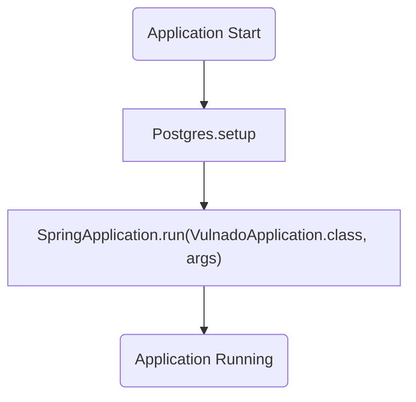
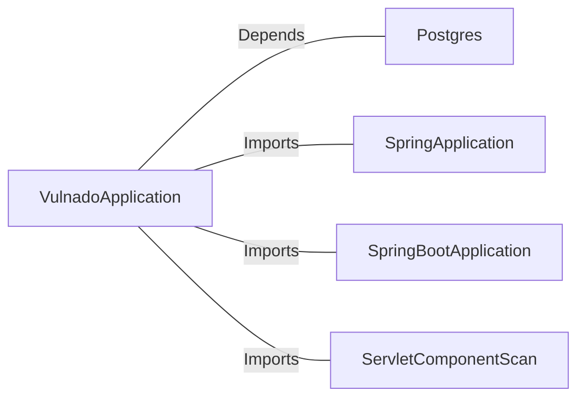

# VulnadoApplication.java: Spring Boot Application Entry Point

## Overview
The `VulnadoApplication` class serves as the entry point for a Spring Boot application. It initializes the application context and sets up the necessary configurations. Additionally, it appears to invoke a `Postgres.setup` method, which likely handles database initialization or configuration.

## Process Flow
The following diagram illustrates the main process flow of the `VulnadoApplication` class:

## Insights
- The class uses Spring Boot annotations (`@SpringBootApplication` and `@ServletComponentScan`) to configure the application.
- The `Postgres.setup` method is invoked before starting the Spring Boot application, indicating that database setup is a prerequisite.
- The `main` method is the entry point for the application, following the standard Java convention.

## Dependencies

- `Postgres`: Likely a class or utility responsible for database setup. The `setup` method is called without parameters.
- `SpringApplication`: A Spring Boot utility class used to bootstrap the application.
- `SpringBootApplication`: Annotation that marks the class as a Spring Boot application.
- `ServletComponentScan`: Annotation that enables scanning for servlet components.

## Vulnerabilities
- **Hardcoded Database Setup**: The `Postgres.setup` method is invoked directly, but its implementation is not shown. If it uses hardcoded credentials or insecure configurations, it could lead to vulnerabilities.
- **Missing Exception Handling**: The `main` method does not include exception handling, which could result in ungraceful application termination if an error occurs during startup.
- **Potential Dependency Mismanagement**: If `Postgres.setup` interacts with the database insecurely (e.g., without SSL or proper authentication), it could expose the application to attacks.

## Recommendations
- Ensure that `Postgres.setup` uses secure configurations, such as encrypted connections and environment variables for credentials.
- Add exception handling in the `main` method to gracefully handle errors during application startup.
- Validate all external dependencies for security best practices.
